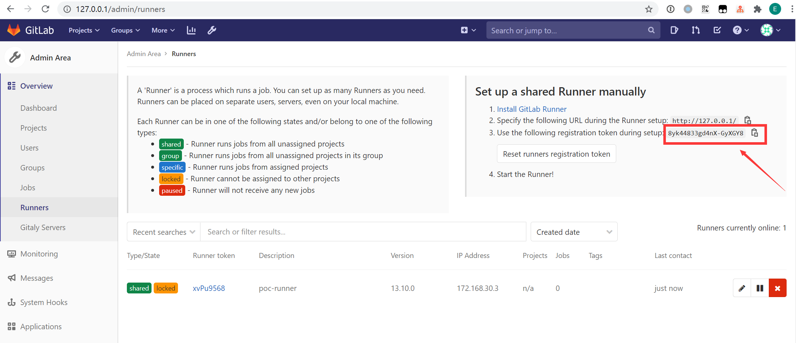

# Gitlab-Docker

> One-click deployment of Gitlab cracked version with docker

------

## 0x10 Environment description

  

## 0x20 Directory structure

```
gitlab-docker
├── README.md ............... [This README description]
├── imgs .................... [Images to assist README description]
├── gitlab .................. [Gitlab container mount directory]
│ ├── Dockerfile .......... [Gitlab Docker build file]
│ ├── config .............. [Gitlab configuration mount directory]
│ ├── data ................ [Gitlab data mount directory]
│ ├── logs ................ [Gitlab log mount directory]
│ ├── keys ................ [Gitlab cracked license storage directory]
│ └── nginx ............... [Gitlab built-in nginx configuration directory (backup configuration, do not change)]
├── runner .................. [Gitlab container mount directory]
├── license ................. [Cracked License container build directory]
│ ├── Dockerfile .......... [License Docker build file]
│ └── license.rb .......... [Generate a Ruby script to crack the license]
├── docker-compose.yml ...... [Docker build configuration]
├── keygen.ps1 .............. [Windows: Generate cracked license with one click]
├── keygen.sh ............... [Linux: Generate cracked license with one click]
├── run.ps1 ................. [Windows: Run Gitlab target range with one click]
├── run.sh .................. [Linux: Run Gitlab target range with one click]
├── register.ps1 ............ [Windows: Register Runner with one click]
├── register.sh ............. [Linux: Register Runner with one click]
├── stop.ps1 ................ [Windows: Stop Gitlab target range with one click]
└── stop.sh ................. [Linux: Stop Gitlab target range with one click]
```

## 0x30 Deployment instructions

### 0x31 Build

- Pre-install docker and docker-compose on the host
- Download this repository: [git clone https://github.com/lyy289065406/gitlab-docker](https://github.com/lyy289065406/gitlab-docker)
- Generate a cracked key pair: [`./keygen.sh`](keygen.sh) or [`./keygen.ps1`](keygen.ps1)
- Build and run Gitlab (make sure port 80 is not occupied): [`./run.sh`](run.sh) or [`./run.ps1`](run.ps1)
- You can log in to Gitlab from the browser after about 5 minutes: [http://127.0.0.1](http://127.0.0.1) (You need to reset the password of the administrator account root for the first login)

### 0x32 cracking

When generating the cracked key pair above, the public key has been written to the Gitlab container backend, and the private key needs to be uploaded to Gitlab through the frontend Complete the cracking:

- Generate the key pair to the [`./gitlab/keys/`](gitlab/keys/) directory, copy the contents of the `.gitlab-license` (private key)
- Use the root user to open the [http://127.0.0.1/admin/license/new](http://127.0.0.1/admin/license/new) page
- Select `Enter license key` and paste the private key, click the `Upload license` button to complete the cracking


### 0x33 Set up Runner

- Use the root user to open the [http://127.0.0.1/admin/runners](http://127.0.0.1/admin/runners) page
- Find the registration token and copy it
- Register Runner: [`./register.sh $TOKEN`](register.sh) or [`./register.ps1 $TOKEN`](register.ps1)

> Now all repositories can use this Runner to execute CI scripts (Pipeline Jobs)



### 0x34 Access Gitlab Pages

Assuming your Gitlab username is `${username}` and the repository name is `${repository_name}`, when the repository has successfully built SSG using jekyll, you only need to access the following URL:

[http://127.0.0.1:8000/${username}/${repository_name}/public/](http://127.0.0.1:8000)

